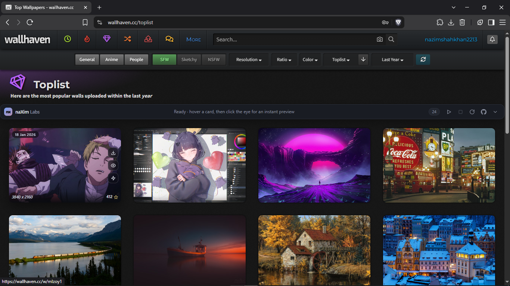
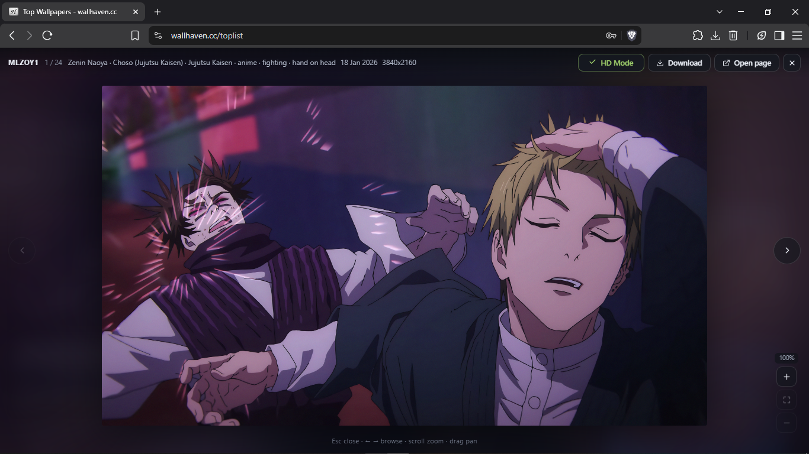
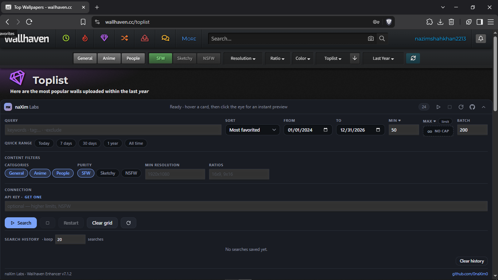
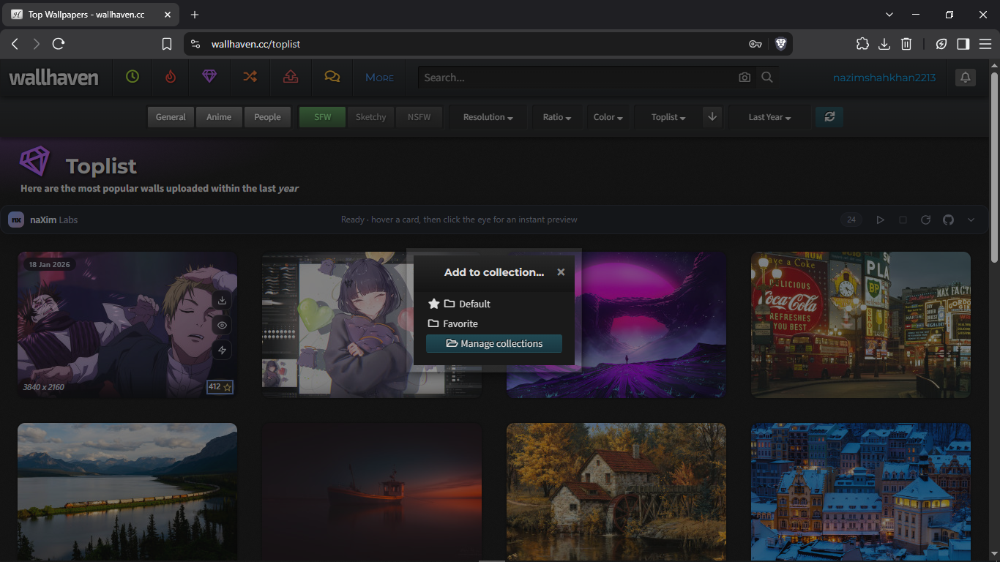

# Wallhaven Enhancer

A focused Tampermonkey userscript by **naXim Labs** (v7.5.1) that makes Wallhaven galleries faster to explore. It adds instant full-resolution previews, wallpaper metadata, direct original-file downloads, and keyboard browsing without replacing Wallhaven’s native pages.

## Features

- Add preview and original-download actions to wallpaper cards.
- Open a full-screen, high-resolution preview without leaving the gallery.
- Browse the current gallery with **Left / Right Arrow** keys.
- Download wallpapers with filenames generated from the wallpaper’s tags on Wallhaven.
- Download the original wallpaper with **D** or the Download button.
- Open the native Wallhaven page from the preview.
- Show resolution, category, and favorite-count metadata.
- Detect cards added dynamically after filtering or pagination.
- Keep requests rate-conscious with an in-memory metadata cache.
- AND MUCH MORE !!!

## Installation with Tampermonkey

1. Install [Tampermonkey](https://www.tampermonkey.net/) for your browser.
2. Use the JavaScript install link below. **Do not use the GitHub blob page or a raw GitHub URL if your browser only displays it as plain text.** The jsDelivr link serves the file with a JavaScript content type and should open Tampermonkey’s installation screen.
3. Review the requested permissions and select **Install**.
4. Open or refresh [Wallhaven](https://wallhaven.cc/).

### Install Wallhaven Enhancer

**[Install with Tampermonkey](https://cdn.jsdelivr.net/gh/0naXim0/wallhaven-enhancer@main/wallhaven-enhancer.user.js)**

The same CDN URL is embedded in the script’s `@downloadURL` and `@updateURL` metadata so Tampermonkey can check for updates. The GitHub source remains available for inspection:

[View the source userscript](https://github.com/0naXim0/wallhaven-enhancer/blob/main/wallhaven-enhancer.user.js)

## Screenshots

## Controls

| Control | Action |
|---|---|
| Preview button | Open an instant full-screen preview |
| Download button | Download the original wallpaper |
| Left / Right Arrow | Browse the previous or next gallery item |
| `D` | Download the current preview |
| `Escape` | Close the preview |
| Click preview image | Open the native Wallhaven page |

## Releases

The current stable v7.5.1 package and direct `.user.js` download are published in the repository’s [Releases](https://github.com/0naXim0/wallhaven-enhancer/releases) tab. The source userscript is also kept at the repository root so it is easy to inspect, fork, and update.

## Permissions and privacy

The script requests `GM_xmlhttpRequest` to read public Wallhaven metadata and `GM_download` for direct original-file downloads. It does not send data to naXim Labs, use an API key, or collect analytics. Wallhaven’s own terms, copyright, and content policies still apply to every wallpaper.

## Author

Created and maintained by [naXim Labs](https://github.com/0naXim0) (Nazim Shah).

- Source: [github.com/0naXim0/wallhaven-enhancer](https://github.com/0naXim0/wallhaven-enhancer)
- Portfolio: [naxim-labs.netlify.app](https://naxim-labs.netlify.app)

## License

MIT License. See [LICENSE](LICENSE).
